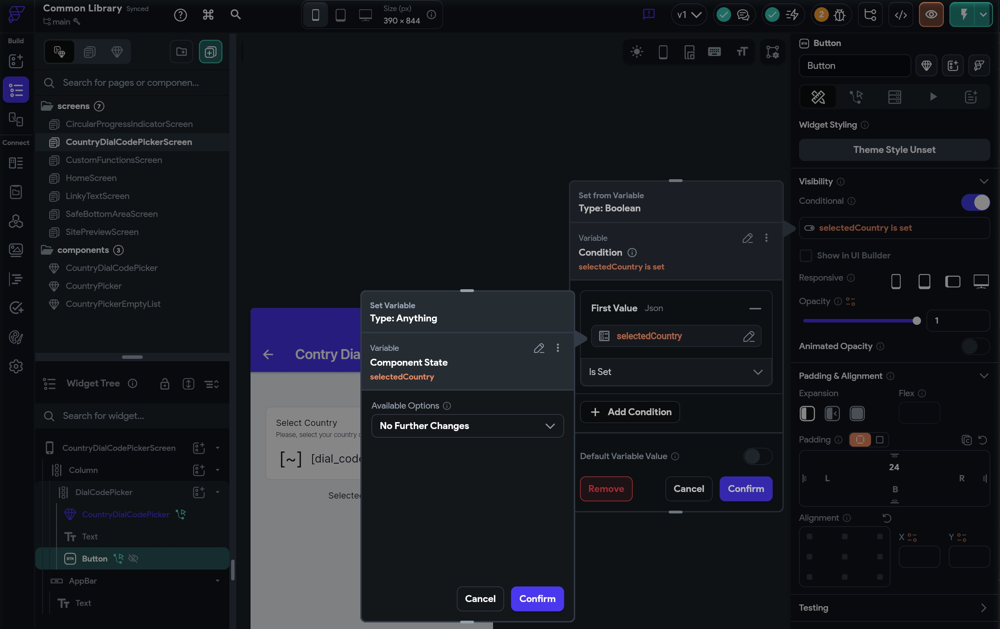
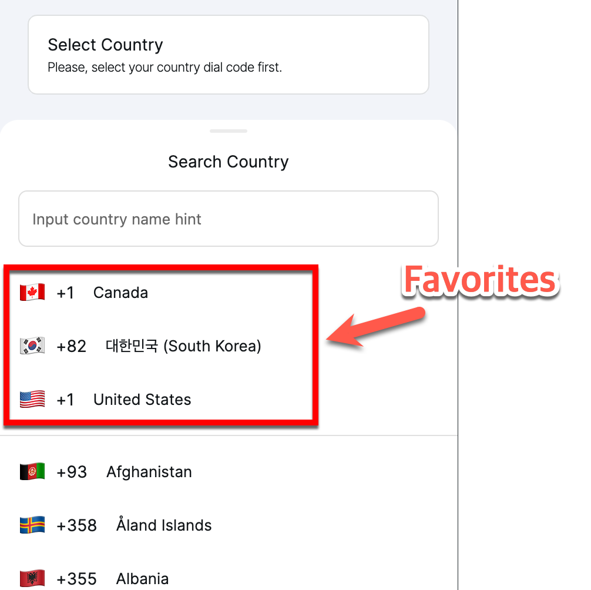

# Country Picker

# Country Picker Component

The Country Picker component allows you to easily get country dial codes and other information. It is primarily designed for selecting country dial codes during phone sign-in but can also be used for other purposes, such as:

- Getting the country flag
- Getting the country name
- Getting the two-letter country code

## Conditionally show widgets

- If you want to display a wdiget (UI) only if the dialog is selected,
    - You can conditionally show the widget when the `selectedCountry` of the Component State in the `CountryDialCodePicker` component.

## Screenshots

### Country Selector

.png)

### maWhen a Country is Selected

.png)

### Country Search Bottom Sheet

