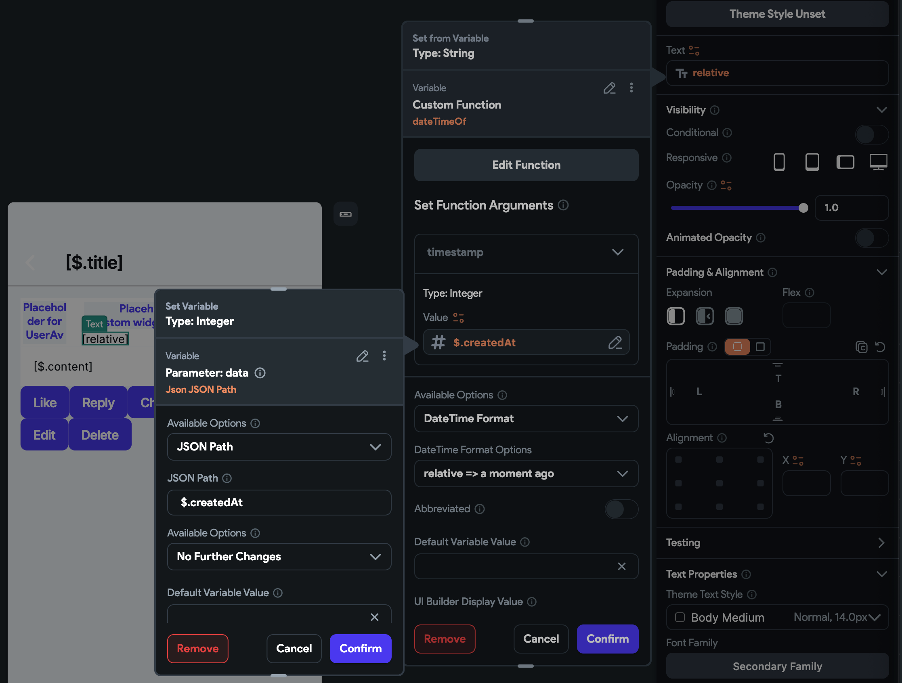

# Custom Functions

- [Custom Functions](#custom-functions)
  - [`endRange`](#endrange)
    - [Purpose](#purpose)
    - [Why Use This Function?](#why-use-this-function)
    - [Example Use Case](#example-use-case)
    - [Backend Query Example](#backend-query-example)
  - [`dateTimeOf` Custom Function](#datetimeof-custom-function)
    - [Returns](#returns)
    - [Behavior](#behavior)
    - [Example of using the `dateTimeOf` custom function](#example-of-using-the-datetimeof-custom-function)
  - [`shortDateTimeOf(DateTime date)`](#shortdatetimeofdatetime-date)
  - [`double depth(int n)`](#double-depthint-n)
  - [`generateEmptyList(int length)`](#generateemptylistint-length)
  - [`List<String> keys(dynamic json)`](#liststring-keysdynamic-json)


## `endRange`

### Purpose

Returns the end string of the search range.

### Why Use This Function?

This function is designed for querying a string field within a specific range.

### Example Use Case

Suppose you want to search for names that begin with "You". You can query like this:

```sql
name >= "You" && name < "You\uf8ff"
```

### Backend Query Example

Below is an example of a backend query in a ListView to perform a case-insensitive user search.

.png)


## `dateTimeOf` Custom Function

The `dateTimeOf` custom function converts a number into a `DateTime` object. The parameter should be a timestamp in seconds or milliseconds.

### Returns

A `DateTime` object from a timestamp.

### Behavior

- **Seconds to Milliseconds**: If the timestamp is in seconds, it will be converted to milliseconds and returns into the DateTime of it.
- **Null Timestamp**: If the timestamp is null, it will return the current time.
- **Non-Integer Timestamp**: If the timestamp is not an integer, it will throw an exception.
- **Negative Timestamp**: If the timestamp is negative, it will throw an exception.
- **Zero Timestamp**: If the timestamp is zero, it will return the current time.

### Example of using the `dateTimeOf` custom function

See below to understand better on how to using it.




## `shortDateTimeOf(DateTime date)`


## `double depth(int n)`

- Returns 

## `generateEmptyList(int length)`

Returns a list of element.

- Use this to generate a list of element to use it in a `Generate dynamic children` panel.


## `List<String> keys(dynamic json)`

Returns the keys of the JSON object.

- `json` can be null, or JSON type data.

