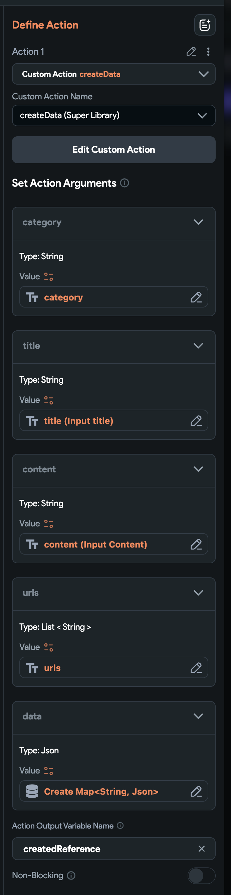
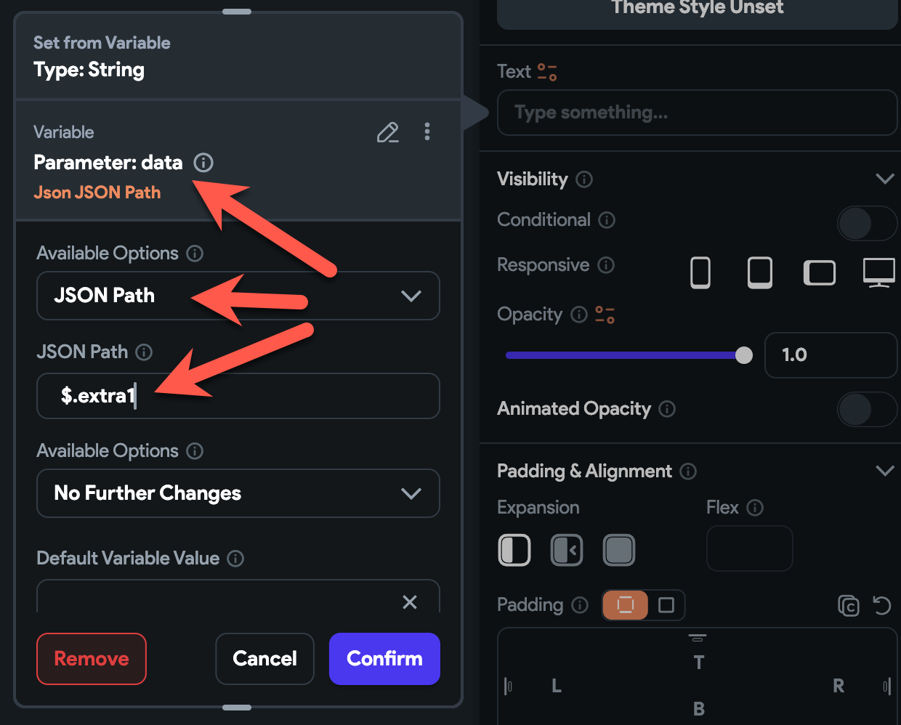

# Data

Imagine you are building a social app that displays users' tweets, photos, and comments on a scrollable main screen. If your app grows, using Firestore can become expensive due to the costs associated with reading, writing, and downloading the size of documents from Firestore.

Using the Realtime Database is faster, cheaper, and simpler.


- [Data](#data)
  - [Features](#features)
  - [Suggested Use Cases](#suggested-use-cases)
  - [Installation](#installation)
  - [Database Structure](#database-structure)
    - [Security](#security)
    - [Data Format](#data-format)
    - [Example Structure](#example-structure)
    - [Fields of a Node](#fields-of-a-node)
  - [Openning data list screen](#openning-data-list-screen)
  - [Create a data](#create-a-data)
  - [List data group by category](#list-data-group-by-category)
    - [Custom design on data list screen](#custom-design-on-data-list-screen)
    - [Display data value in custom design](#display-data-value-in-custom-design)
  - [Displaying Data Details](#displaying-data-details)
  - [Reactivity of the Data](#reactivity-of-the-data)
    - [DataChange widget](#datachange-widget)
  - [Data custom actions](#data-custom-actions)
    - [createData](#createdata)
    - [updateData](#updatedata)
    - [readData](#readdata)
    - [deleteData](#deletedata)
  - [Developer's guide line](#developers-guide-line)
    - [To get data of a category in order](#to-get-data-of-a-category-in-order)


## Features

The `Data` provides default CRUD operations for the Realtime Database:

- **readData**: Custom action to read data.
- **createData**: Custom action to create data.
- **updateData**: Custom action to update data.
- **deleteData**: Custom action to delete data.
- **DataListView**: Widget to display a list of values in a data group.
- **DataChange**: Widget that calls a callback action when the data changes. It is used to display the changes of the data on the screen.

With the `Comment`, you can easily build blog or forum community apps. Refer to the `Comment` documentation for more details.

## Suggested Use Cases

If you want to build the following features in your apps, `Data` functionality is good;

- Blogs, News, Reminders
- Forum (Built-in BBS) based community apps
- Social apps with listing/scrolling activity wall screen
- Shopping mall apps
- Any functionality that related in creating and listing articles

## Installation

```json
"data": {
  ".read": true,
  "$key": {
    ".write": "newData.child('uid').val() === auth.uid || ( data.child('uid').val() === auth.uid && !newData.exists() )",
    "category": {
      ".validate": "newData.val().length > 0"
    }
  }
},
```

## Database Structure

To achieve the concept of `SSOT` (Single Source of Truth), we save all data in the `/data` node in the Realtime Database.

### Security

- To prevent attacks that involve writing excessively large data (e.g., very long titles or content), you can add security rules to limit the size of these fields.
    - By default, the title is limited in `2048` letters and the content is limited in `65536` letters by the security rules. You can change them and add more rules.

### Data Format

- Data in the Realtime Database is stored in JSON format.
- The first level of keys in the `/data` node are the IDs of the data entries.
- The second level of keys are the properties of each data entry.

### Example Structure

```json
/data {
    "key-1": {
        "property-1": "...",
        "property-2": "..."
    },
    "key-2": {
        "property-1": "...",
        "property-2": "..."
    }
}
```

### Fields of a Node

- **uid**: The creator's user ID.
- **category**: The category of the data, ordered by recent data(article).
- **order**: The order of the data.
- **title**: The title of the data.
- **content**: The content of the data.
- **urls**: URLs of photos and files associated with the data.
- **createdAt**: The creation timestamp.
- **updatedAt**: The update timestamp.
- **custom fields**: You can add as much extra fields as you want.

Example representation:

```json
/data
  /key-1 {
    "category": "qna-1630000000000",
    "order": -1630000000000,
    "uid": "uid",
    "title": "title",
    "content": "content",
    "urls": ["url1", "url2"],
    "createdAt": 1630000000000,
    "updatedAt": 1630000000000
  }
```

## Openning data list screen

- Create a screen to list the data.
    - Let's name it as `DataListScreen`.
    - Add a required page parameter named `category` with the type of String.
- Insert the `DataListView` in the body passing the `category` page parameter.
- Add a create button on the app bar.
    - When the user taps, open the `DataCreateScreen`.

## Create a data

- Create a screen to create a data.
    - Let's name it as `DataCreateScreen`.
    - Add a required page parameter named `category` with the type of String.
- Add some text fields with submit button.
    - Text field of title, content would be needed.
    - You can add any extra fields(key/value pair) into the data.
- When the user taps on the submit button, you can connect the `createData` custom action like below.
    - For category field, pass the category of page parameter.
    - For title, pass the input text of title.
    - For content, pass the input text of content.
    - For extra field, you need to pass an JSON object. It is a good idea to create a `Create Map` to save extra keys/values into the data.
    - For urls field, you need to pass a List of String. It can by an empty List.



- Add `onCreate` action to navigate back to the DataListScreen.
- Add `onFailure` action to dsiplay the error.

## List data group by category

- Create a screen named `DataListScreen` to display the list of a data group by category.
    - Add a required page parameter named `category` with the type of String.

- Add `DataListView` super library widget into the body
  - Pass the category page parameter to the widget.


### Custom design on data list screen

- If you want to customize the design in `DataListView` with your component.
  - Create a component named as `AppDataListTile`. In fact, it can be any name.
  - Simply pass the `AppDataListTile` to widget builder of the `DataListView` custom widget.
    - Display the data information in the `AppDataListTile` component. It's really upto you what information you want to show in your custom design.
    - Add the `data` parameter of `JSON` type to your `AppDataListTile` component.

### Display data value in custom design

- Data passed to your component is in JSON. So, you can use the `JSON path` to display what's in the data. For instance
    - `$.title`: the title of the data
    - `$.content`: the content of the data
    - `$.uid`: the uid of the creator.
        - You can display the creator's avatar by passing the uid to `UserAvatar`.
        - You can dispaly the creator's display name by passing the uid to `DisplayName`.
    - `$.createdAt`: the timestamp of the data creation.
    - `$.urls`: the string array of urls that are saved with the data.
    - `$.category`: the category.


- You can add and display whatever key/value pairs as much as you want.
    - Below is an example of showing the custom key/value data.




## Displaying Data Details

You can design the UI/UX based on your specific needs.

To display full details of the data when tapped from the `DataListView` or a custom component, follow these steps:

1. **Create a Screen**: 
   - Name it `DataViewScreen`.
   - Add a required page parameter named `data` of the JSON type.

2. **Open DataViewScreen**:
   - When an item is tapped in the `DataListView`, open `DataViewScreen` with the `data` parameter.

3. **Design DataViewScreen**:
   - Customize the screen to display the data details.
   - Consider adding the following buttons:
     - `like`
     - `reply`
     - `chat`
     - `block`
     - `report`
     - `edit`
     - `delete`
   - Add a tap action on the user's profile photo to open the user's public profile screen.
   - Add a tap action to show the original image if displaying thumbnails.


## Reactivity of the Data

### DataChange widget

The `DataChange` widget listens and rebuild your component whenever the data changes.

For instance, you build a forum app

- To reflect the changes of the title,
  - Create a component named `PostTitle` with a String `title` parameter.
    - And display the `title` in the component.
  - Then, add the `DataChange` widget on your screen(or a component)
    - Passing the `dataKey` as the data key,
    - and the `field` as `title`.
    - Then, add the `PostTitle` component to the `builder` of the `DataChange` widget.
      - pass the widget builder parameter `data` to `title` parameter of `PostTile` 


- To reflect the content and other properties of the data,
  - Create a component named `PostData` with a JSON `data` parameter.
    - And display the properties of the data by accessing `$.title`, `$.content`, `$.uid`, `$.createdAt`, `$.urls`, and more.
      - Since the parameter of the `data` is JSON and it has the whole data, you can display whatever you like.
  - Then, add the `DataChange` widget on yor screen(or a comment)
    - Passing the `dataKey` as the data key,
    - and the `field` as null
    - Then pass the `PostData` to the `builder` of the `DataChange` widget.
      - Pass the widget builder parameter `data` to the `data` parameter of the  `PostData`.

You can use the `DataChange` to listen for the realtime update of the data.


## Data custom actions

### createData

### updateData

### readData

- You may use `readData` custom action to read the data on data update screen.


### deleteData

- **onDelete**: this callback action will be called if the data has been deleted.
- **onFailure**: this callback action will be called if the deletion has failed.


## Developer's guide line

### To get data of a category in order

```dart
final ref = PostService.instance.postsRef
    .orderByChild('category')
    .startAt('$category-')
    .endAt('$category-9999999999999999999999');

final snapshot = await ref.get();
for (var v in snapshot.children) {
  log('v: ${v.key}, value: ${(v.value as Map)["title"]}');
}
```