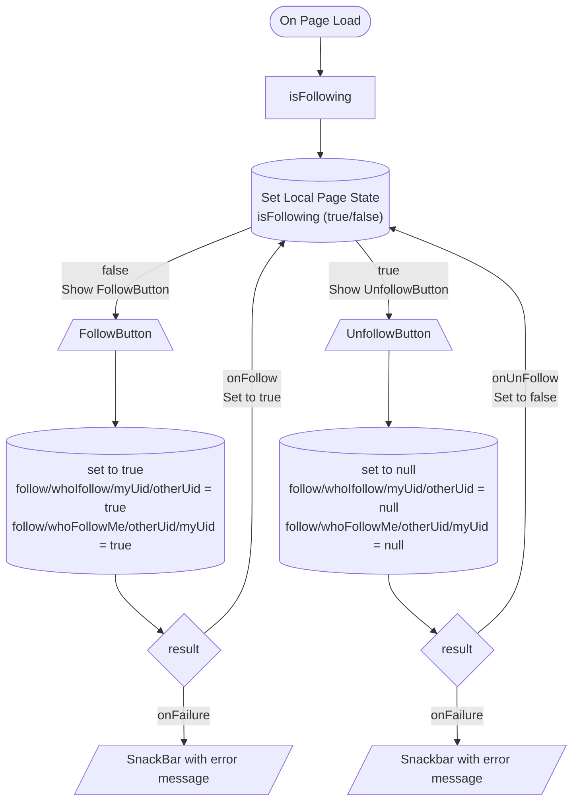

# Feed API

In this document, the feed functionality for FlutterFlow is explained. If you want to work with the source coding, please refer the [Feed API in Developer Guideline](./developer_guideline.md#feed-api).

## Features

Feed API allows you to follow and unfollow users.
It also gives you an option to get who follow you and who you follow.

- **follow**: Custom action to follow other user.
- **unfollow**: Custom action to unfollow other user you are following.
- **isFollowing**: Custom action to check if you are following the other user.
- **getWhoFollowMe**: Custom action to get a list of users who follow me.
- **getWhoIFollow**: Custom action to get a list of users who I follow.
- **createFeed**: Custom action to create a feed.
- **updateFeed**: Custom action to update a feed.
- **deleteFeed**: Custom action to delete a feed.

## Suggested Use Case

- Showing the feeds of the other users that the current user is following.
- Showing a button to follow/unfollow the other user.
- Display who follow the user and who the user follows.

## How to use follow, unfollow and isFollowing custom actions

1. Create a screen named `PublicProfileScreen`.
2. Create a Local page state variable and named it as `isFollowing` with `Boolean` as type.

   

3. Under the page `On Page Load` trigger add the `isFollowing` custom action.

   - **otherUid**: Pass the uid of the other user.
   - **callback**: This callback will return boolean if you follow or not the other user.

     

   - Inside the `callback` action, add an action that will update the local page state variable `isFollowing` with the return value.

     

4. Next, add a button on the screen and name it as `FollowButton`.

   - Select `FollowButton` widget and under the widget property panel add the custom action `follow` .

     - **otherUid**: Input the other user uid.
     - **onFollow**: This callback will be called if no error on follow action.
     - **onFailure**: This callback will trigger if theres any error on the action with an error message.

       

   e.g. **onFollow**

   - (Optional) Show a snack message success follow.
   - Set the local page state variable `isFollowing` to true.

   

   e.g. **onFailure** Show a snack message with the error message..

   

5. Next, Add a button on the screen and name it `UnfollowButton`.

   - Select `UnfollowButton` widget and under the widget property panel add and action and select the custom action `unfollow`.

     - **otherUid**: Input the other user uid.
     - **onUnfollow**: This callback will be called if no error on unfollow action.
     - **onFailure**: This callback will trigger if theres any error on the action with an error message.

       

   e.g. **onUnfollow**

   - (Optional) Show a snack message success unfollow.
   - Set the local page state variable `isFollowing` to false.

   

   e.g. **onFailure** Show a snack message with the error message.

   

## getWhoFollowMe

## getWhoIFollow

## createFeed

## updateFeed

## deleteFeed
