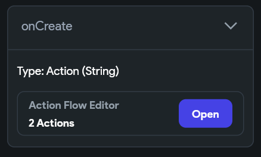
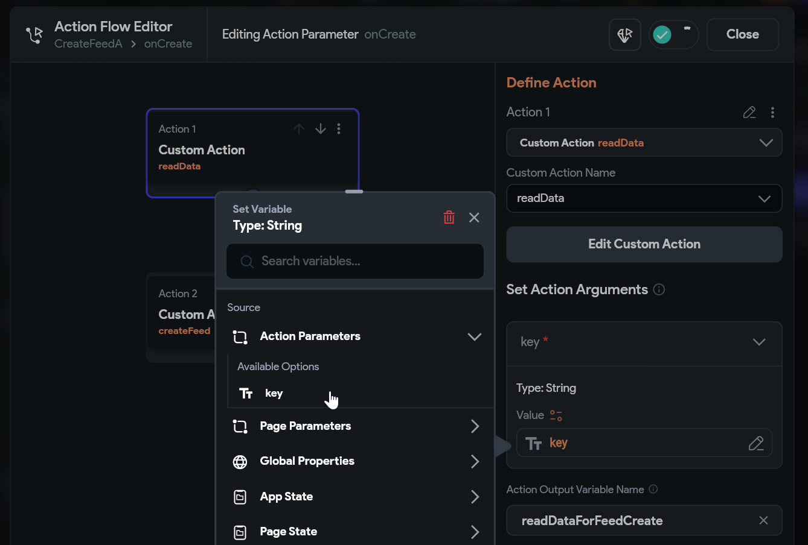
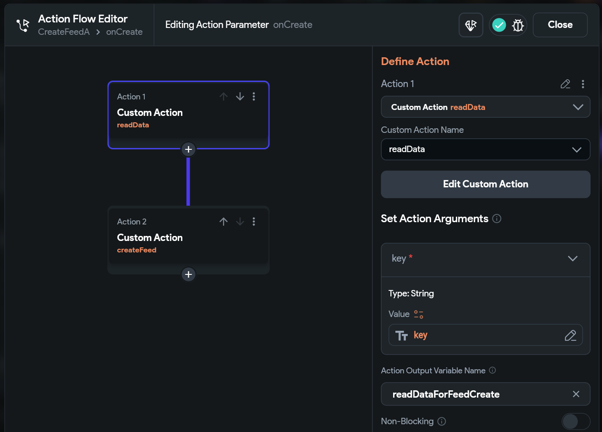
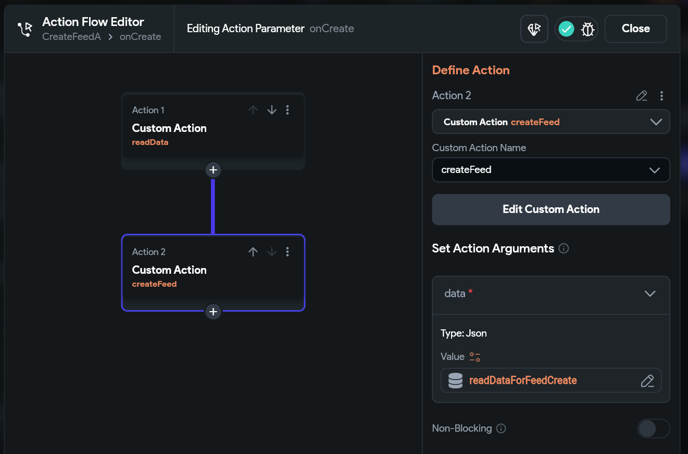

# Feed API

In this document, the feed functionality for FlutterFlow is explained. If you want to work with the source coding, please refer the [Feed API in Developer Guideline](./developer_guideline.md#feed-api).

## Features

Feed API allows you to follow and unfollow users. It also gives you an option to get who follow you and who you follow.

- **isFollowing**: Custom action to check if you are following the other user.
- **follow**: Custom action to follow other user.
- **unfollow**: Custom action to unfollow other user you are following.

- **getWhoFollowMe**: Custom action to get a list of users who follow me.
- **getWhoIFollow**: Custom action to get a list of users who I follow.
- **createFeed**: Custom action to create a feed.
- **updateFeed**: Custom action to update a feed.
- **deleteFeed**: Custom action to delete a feed.

## Suggested Use Case

- Showing the feeds of the other users that the current user is following.
- Showing a button to follow/unfollow the other user.
- Display who follow the user and who the user follows.
- Create Feed after a Data is created.
- Update Feed after a Data is updated.
- Delete Feed after a Data is deleted.

## How to use follow, unfollow and isFollowing custom actions

- Create a screen named `PublicProfileScreen`.
- Create a Local page state variable and named it as `isFollowing` with `Boolean` as type.

  

- Under the page `On Page Load` trigger add the `isFollowing` custom action.

  - **otherUid**: Pass the uid of the other user.
  - **callback**: This callback will return boolean if you follow or not the other user.

    

  - Inside the `callback` action, add an action that will update the local page state variable `isFollowing` with the return value.

    

- Next, add a button on the screen and name it as `FollowButton` change the text to `Follow`.

  - Select `FollowButton` widget and under the widget property panel add the custom action `follow` .

    - **otherUid**: Input the other user uid.
    - **onFollow**: This callback will be called if no error on follow action.
    - **onFailure**: This callback will trigger if theres any error on the action with an error message.

      

  e.g. **onFollow**

  - (Optional) Show a snack message success follow.
  - Set the local page state variable `isFollowing` to true.

    

  e.g. **onFailure** Show a snack message with the error message..

  

- Next, Add a button on the screen and name it `UnfollowButton` change the text to `Unfollow`.

  - Select `UnfollowButton` widget and under the widget property panel add and action and select the custom action `unfollow`.

    - **otherUid**: Input the other user uid.
    - **onUnfollow**: This callback will be called if no error on unfollow action.
    - **onFailure**: This callback will trigger if theres any error on the action with an error message.

      

  e.g. **onUnfollow**

  - (Optional) Show a snack message success unfollow.
  - Set the local page state variable `isFollowing` to false.

  

  e.g. **onFailure** Show a snack message with the error message.

  

- Lastly, to show only the button that is needed. we will wrap this two button with contidinal widget. and the select the isFollowing local state for the condition.

  

- And the widget tree will look like below.

  

- Run the app and it should toggle from Follow to Unfollow when the button is clicked.

## How to display users who follow me

- Create a new screen named `WhoFollowMeScreen`.
- Get the List of users who follow me using the `getWhoFollowMe` custom action.

  - First select the page and add an action `On Page Load` trigger, then add the `getWhoFollowMe` custom action and set the `Action Output Variable Name` e.g `getWhoFollowMeOutput`.

    

  - Then rebuild the current page once the data is loaded. We add another action `Update Page State` no need to set any field, just change the `Update Type` to `Rebuild Current Page`.

    

- Sample Setup to display the users who follow me.

  - On the widget tree add a `Row Widget` or `Column Widget`, in this case we will use a `Row Widget`.
  - Inside the `Row widget` add a `Column Widget`.
  - Inside the `Column Widget` add the `UserAvatarComponent` and `UserDisplayNameComponent`.
  - Your Widget Tree will look like below.

    

- **Important!** To avoid null error, first we need to check if the `getWhoFollowMeOutput` Action output has value. You can either hide the row when the output is not set or you can wrap the row with conditional widget and display empty message if the output is not set or empty.

  - In this example we will just hide the Row if the output is not set.

  - First Select the `Row Widget`,

  - Under the widget properties, enable the visibility set the condition by navigating to action output, select `getWhoFollowMeOutput` and from the available option select `Is Set and Not Empty` and confirm.

    

- Next to use the `getWhoFollowMeOutput` action output, on the Property Panel click the 4th Tab (Generate Dynamic Children tab).
- Input Variable Name. e.g. `whoFollowMe`
- Next set the `Value` by Navigating to `Action Outputs` and in the Available Options select the `getWhoFollowMeOutput` that we set from the `On Page Load` trigger and click confirm.

  

- Then click `Save`, this will promt that this action will generate its children dynamically and click `Ok`.

  

- Now we can use the `whoFollowMe` variable inside the UserAvatarComponent and UserDisplayNameComponent.
- Select the `UserAvatarComponent` from the widget tree

  - Set the variable for the `uid`, select the `whoFollowMe Item` from the source.

    

  - First Available Options select `JSON Path`.
  - For the JSON Path input `$.uid`.
  - Then on the next Available Options select `No Further Changes`.

    

- Do the same with the `UserDisplayNameComponent`.

  

- Your canvas should look like this. Run the app and if you have followers, then it should display the avatar and display name of the followers.

  

## How to display users who I follow

- Create another screen named `WhoIFollowScreen`.
- Get the List of users who I follow using the `getWhoIFollow` custom action.

  - Select the page then add an action `On Page Load` trigger, then add the `getWhoIFollow` custom action and set the `Action Output Variable Name` e.g `getWhoIFollowOutput`.

    

  - Then rebuild the current page once the data is loaded. We add another action `Update Page State` no need to set any field, just change the `Update Type` to `Rebuild Current Page`.

    

- Sample Setup to display the users who I follow.

  - This time we will use `Column Widget`, since newly created screen has `Column Widget` we dont need to add anymore.
  - Inside the `Column Widget`, add a `Row Widget`.
  - Then inside the `Row Widget` add the `UserAvatarComponent` and `UserDisplayNameComponent`.
  - Your Widget Tree will look like below.

    

- **Important!** To avoid null error, first we need to check if the `getWhoIFollowOutput` Action output has value. You can either hide the Column when the output is not set or you can wrap the Column with conditional widget and display empty message if the output is not set or empty.

- First Select the `Column Widget`

- Under the widget properties, enable the visibility set the condition by navigating to action output, select `getWhoIFollowOutput` and from the available option select `Is Set and Not Empty` and confirm.

  

- Next to use the `getWhoIFollowOutput` action output, on the Property Panel click the 4th Tab (Generate Dynamic Children tab).
- Input Variable Name. e.g. `whoIFollow`
- Next set the `Value` by Navigating to `Action Outputs` and in the Available Options select the `getWhoIFollowOutput` that we set from the `On Page Load` trigger and click confirm.

- Then click `Save`, this will promt that this action will generate its children dynamically and click `Ok`.

  

- Now we can use the `whoIFollow` variable inside the UserAvatarComponent and UserDisplayNameComponent.

- Select the `UserAvatarComponent` from the widget tree

  - Set the variable for the `uid`, select the `whoFollowMe Item` from the source.

    

  - First Available Options select `No Further Changes` then confirm.

    

- Do the same with the `UserDisplayNameComponent`.

  

- Your canvas should look like this. Run the app and if you have followers, then it should display the avatar and display name of the followers.

  

## How to use createFeed

Feed is often use after a data was created. e.g. A user post a data, then we create the feed of this user followers using the information from the data.

Created feeds will have the following fields and will be added to followers feed of the current user:

/follow/feed/$otherUid/$dataKey

```json
/follow
    /feed
        /$otherUid
            /$dataKey
                {
                    "content": "data content",
                    "createdAt": "data createdAt",
                    "displayName": "Author display name",
                    "photoUrl": "Author photo url",
                    "uid": "Author uid",
                    "urls": ["data urls",],
                    "updatedAt": "data updatedAt"
                }
```

- After a `Data` is created using `createData` Custom Action. It will call the `onCreate` callback that has the `key` of Data that was created. (To know more about `createData` refer to [createData](/super_library/data/#createdata))

  

- Inside the `onCreate` callback we will read the Data first by adding the Custom Action `readData` and passing the `key` from the callback parameter into the key input parameter.

  

- Then we name the Action Output Variable Name e.g. `readDataOutput`. (To know more about `readData` refer to [readData](/super_library/data/#readdata))

  

- After reading the Data we can pass the Action Output `readDataOutput` to create feed to followers using the `createFeed` Custom Action.

  

## How to use updateFeed

Feed is often use after a data was updated. e.g. A user edit a data, and we update the feed of this user followers.

- After a `Data` is updated using `updateData` Custom Action. It will call the `onUpdate` callback that has the `key` of Data that was updated. (To know more about `updateData` refer to [updateData](/super_library/data/#updatedata))

  

- Inside the `onUpdate` callback we will read the Data first by adding the Custom Action `readData` and pass the same `dataKey` to the key input parameter. And named the Action Output Variable Name e.g. `readDataForFeedUpdate`

  

- After reading the Data we can pass the Action Output `readDataForFeedUpdate` to update the followers feed using the `updateFeed` Custom Action.

  

## How to use deleteFeed

delete field requires $dataKey

## How to list feeds
