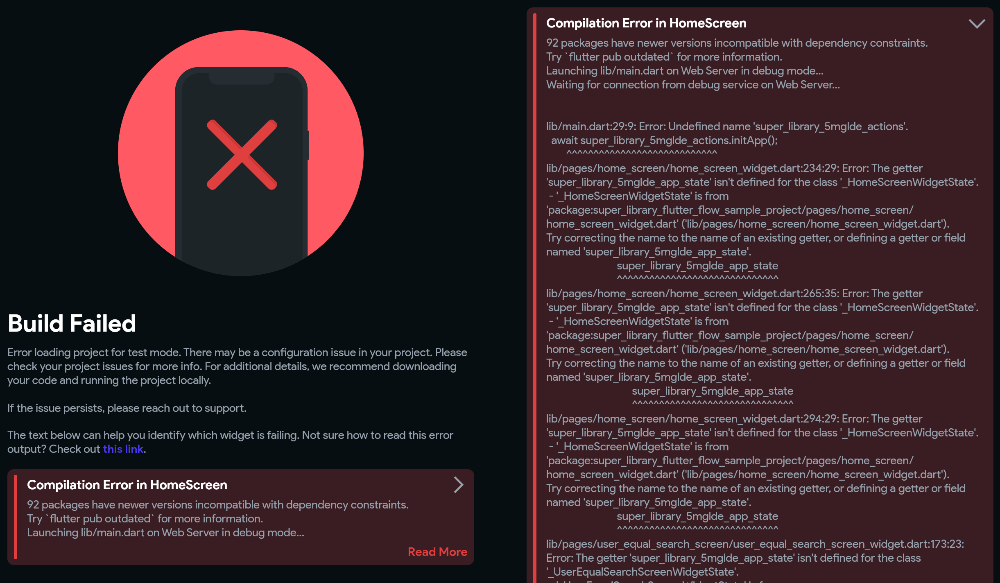

# Known Issues

## Chat Room Name Update Delay

### Issue

When a master edits the chat room name, the change does not take effect immediately. The updated name only appears after a new message is sent in the chat room.

### Impact

This is not a critical error, but it can be confusing for users expecting an immediate update.

### Workaround

Masters can send a message in the chat room right after changing the name to force the update.

### Resolution

We are aware of this issue and plan to fix it in a future update.

## Error on running the app in FlutterFlow

### Build fail error

If you encounter a build failure error message similar to the one below which includes `xxx packages has newer version...`, try re-running the app in FlutterFlow. A simple re-start has worked for us.

